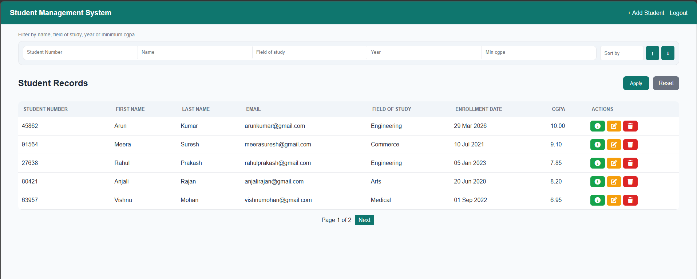

# 🎓 Student Management System (Django + DRF)

A full-stack Student Management System built using Django and Django REST Framework to understand backend development concepts and how they can support real-world applications.

## Features

* User Authentication (Register / Login / Logout)
* Student CRUD operations (Add, View, Update, Delete)
* Advanced filtering (name, CGPA, year, field of study)
* Sorting (ascending & descending)
* Pagination
* **Access control (public viewing, restricted modifications)**
* REST API using Django REST Framework
* JWT Authentication
* Swagger API documentation
* **Form & API validation for data integrity**


## Tech Stack

* Python
* Django
* Django REST Framework
* SQLite
* HTML / CSS


## Screenshots

### Home Page


## Installation

```bash
git clone <your-repo-link>
cd project-folder
pip install -r requirements.txt
python manage.py migrate
python manage.py runserver
```


## API Authentication

JWT token endpoints:

* `/accounts/token/`
* `/accounts/token/refresh/`


## API Features

* Filtering
* Ordering
* Pagination
* JWT Authentication


## Project Structure

The project is divided into two main apps:

* **accounts** → handles user authentication
* **students** → handles student management, validations, views, and API


## Learning Highlights

* Built a full-stack Django application with both UI and REST API
* Implemented authentication (Session + JWT)
* Designed access control (public vs restricted actions)
* Implemented validation using Django Forms and DRF Serializers
* Worked with filtering, sorting, and pagination
* Integrated Swagger for API documentation


## Note

This project was built primarily for learning and understanding core backend concepts.


## Contact

* LinkedIn: [your link]
* Email: [your email]

